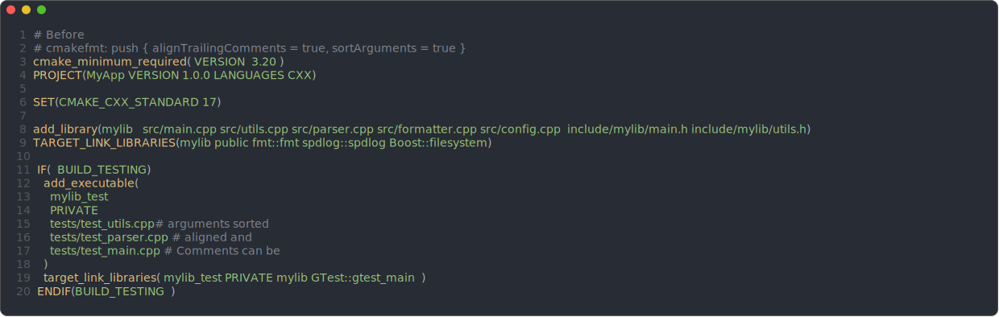
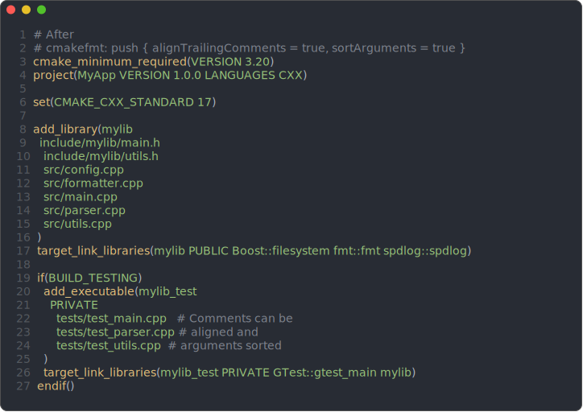

<div align="center">

<picture>
  <source media="(prefers-color-scheme: dark)" srcset="docs/logos/cmakefmt-logo-dark.svg">
  <source media="(prefers-color-scheme: light)" srcset="docs/logos/cmakefmt-logo-light.svg">
  
</picture>

<h1 style="color: #C5BCF7;">cmakefmt</h1>

<p>opinionated cmake formatting</p>

[](https://github.com/azais-corentin/cmakefmt/actions/workflows/ci.yml)
[](https://crates.io/crates/cmakefmt)
[](LICENSE)

[Documentation](https://azais-corentin.github.io/cmakefmt/)
| [Getting Started](https://azais-corentin.github.io/cmakefmt/guide/getting-started)
| [Configuration](https://azais-corentin.github.io/cmakefmt/guide/configuration)

</div>

cmakefmt takes your CMake source files (`CMakeLists.txt` and `*.cmake`), applies a
consistent set of formatting rules, and outputs the result. It normalizes command
casing, keyword casing, indentation, argument wrapping, alignment, and more -- with
over 40 configuration options across 15 categories. If a file cannot be parsed, the
formatter returns it unchanged -- it never silently corrupts your code.

## Before / After

<div style="display: flex; justify-content: center; align-items: flex-start; gap: 2rem; width: 100%;">
  <div style="flex: 1; text-align: center;">
    
    <div><b>Before</b></div>
  </div>
  <div style="flex: 1; text-align: center;">
    
    <div><b>After</b></div>
  </div>
</div>

## Features

- **Command casing** -- normalizes `PROJECT`, `Set`, `IF` to lowercase (or uppercase)
- **Keyword casing** -- normalizes `public`, `Private` to `PUBLIC`, `PRIVATE` (or lowercase)
- **Argument wrapping** -- breaks long argument lists across lines with consistent indentation
- **Alignment** -- aligns property values, condition arguments, and keyword groups
- **Comment formatting** -- reflowing, indentation, and trailing comment alignment
- **Sorting** -- alphabetical sorting of file lists under configurable keywords
- **Per-command overrides** -- fine-grained control over individual commands (e.g. `spaceBeforeParen` for `if`)
- **Inline pragmas** -- `# cmakefmt: off`, `on`, `skip` to suppress formatting locally
- **Safe by default** -- unparseable input is returned unchanged; never silently corrupts

## Installation

### cargo install

```bash
cargo install cmakefmt
```

### Prebuilt Binaries

Download prebuilt binaries for your platform from
[GitHub Releases](https://github.com/azais-corentin/cmakefmt/releases):

- linux-x64, linux-arm64
- macos-x64, macos-arm64
- windows-x64, windows-arm64

### dprint Plugin

Add cmakefmt as a WASM plugin in your `.dprintrc.json`:

```json
{
  "plugins": [
    "https://github.com/azais-corentin/cmakefmt/releases/download/v0.1.1/cmakefmt-v0.1.1.wasm"
  ]
}
```

## Quick Start

Format a file and print to stdout:

```bash
cmakefmt CMakeLists.txt
```

Format in place:

```bash
cmakefmt --write CMakeLists.txt
```

Check formatting without modifying files (exits with code 1 if changes are needed):

```bash
cmakefmt --check CMakeLists.txt
```

Show a unified diff of what would change:

```bash
cmakefmt --diff CMakeLists.txt
```

Format from stdin:

```bash
cat CMakeLists.txt | cmakefmt --stdin
```

## Configuration

Create a `.cmakefmt.toml` (or `cmakefmt.toml`) in your project root. The formatter
discovers config by walking from the formatted file's directory upward to the
filesystem root. All keys use `camelCase`.

```toml
lineWidth = 120
indentWidth = 4
indentStyle = "space"
commandCase = "lower"
keywordCase = "upper"
closingParenNewline = true
lineEnding = "lf"
finalNewline = true
trimTrailingWhitespace = true
endCommandArgs = "remove"

sortArguments = ["SOURCES", "FILES"]
alignPropertyValues = true

ignorePatterns = ["build/**", "third_party/**"]
ignoreCommands = ["ExternalProject_Add"]

[perCommandConfig.if]
spaceBeforeParen = true

[perCommandConfig.elseif]
spaceBeforeParen = true
```

For the full list of options and their defaults, see the
[Configuration Reference](https://azais-corentin.github.io/cmakefmt/guide/configuration).

## Editor Integration

### External Formatter (stdin pipe)

Most editors can invoke an external command to format the current buffer. Configure
your editor to pipe through:

```bash
cmakefmt --stdin --assume-filename <path>
```

The `--assume-filename` flag tells cmakefmt which file path to use for config
discovery (walking upward to find `.cmakefmt.toml`).

### dprint

If you use [dprint](https://dprint.dev/), add the cmakefmt WASM plugin to your
`.dprintrc.json` (see the Installation section above), then use dprint's editor
extensions for VS Code, Neovim, or other supported editors.

## Documentation

Full documentation is available at
[azais-corentin.github.io/cmakefmt](https://azais-corentin.github.io/cmakefmt/).

## License

MIT -- see [LICENSE](LICENSE) for details.
